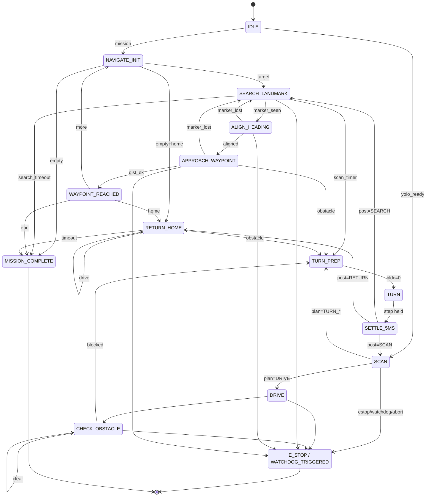
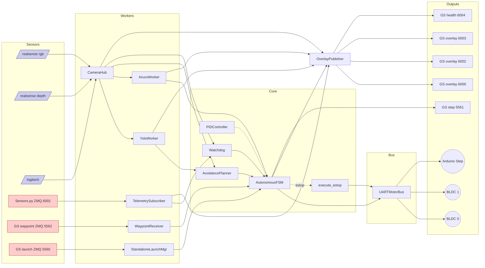

# `autonomous_driver.py` — Detaylı Mimari ve Kod Analizi

> Hedef dosya: `autonomous_driver.py` (2023 satır, tek dosya)
> Bağlam: Marmara Rover ekibi — ERC 2026 Navigation Traverse görevi (§7.3.2.1).
> Bu rapor **referans niteliğindedir**: kod değiştirilmemiştir. Yeni otonom sürüş kodunun yazımı için temel oluşturur.

---

## 1. Genel Mimari

### 1.1. Dosyanın Amacı
`autonomous_driver.py`, ERC 2026 Navigation Traverse görevini "No GNSS + Full Autonomy" konfigürasyonunda yürütmek için tasarlanmış **monolitik** bir sürüş çekirdeğidir. Görev kapsamı:

- Yer istasyonundan ZMQ üzerinden bir **ArUco ID listesi** (waypoint sırası) alınır.
- Her hedef için: **ArUco işaretçisini bul → başlığa hizalan → yaklaş → 1.5 m içinde "ulaşıldı" işaretle**.
- Tüm waypoint'ler tamamlanınca opsiyonel "eve dönüş".
- Tüm süreç boyunca YOLO + derinlik tabanlı **engel kaçınma** ve **watchdog** korumaları aktif.

### 1.2. Çözülen Problem
Rover'ın ön RGB-D kamerası ile (RealSense D435i, 848×480) görsel pozlama yapması; BLDC çekiş motorları ve 4 bağımsız step motorlu direksiyonun aynı anda komut almasını engelleyerek donanım hasarını önlemesi; ground station ile sağlık ve overlay senkronu sağlaması.

### 1.3. Ana Alt Sistemler (Tek Tek Bölüm 2'de açılacak)

| # | Katman | Ana Sınıf/Fonksiyon | Görev |
|---|--------|--------------------|-------|
| 1 | Motor Soyutlaması | `MotorBus`, `UARTMotorBus`, `CANMotorBus` | BLDC + 4 step kontrol |
| 2 | Telemetri | `TelemetrySubscriber` | `Sensors.py` ZMQ (port 6001) abone |
| 3 | Kamera | `CameraHub` (ROS2 Node) | `/logitech`, `/realsense/rgb`, `/realsense/depth` |
| 4 | Algı – Engel | `YoloWorker`, `AvoidancePlanner` | YOLO det + seg |
| 5 | Algı – Hedef | `ArucoWorker` | DICT_5X5_100 + `solvePnP` |
| 6 | Kontrol | `PIDController` | Heading hatasından diferansiyel hız |
| 7 | Yayın | `OverlayPublisher` | Annotated kamera + sağlık (6000/6002/6003/6004) |
| 8 | Görev Girişi | `WaypointReceiver` | ZMQ port 5562 |
| 9 | Güvenlik | `Watchdog`, `execute_estop` | Telemetri/kamera kopukluğu, E-stop |
| 10 | Karar | `AutonomousFSM` (15 state) | 50 Hz ana tick |
| 11 | Arayüz | `StandaloneLaunchManager` | arc_electron için ZMQ REP 5560 |
| 12 | Bootstrap | `main()` | argparse + tüm thread'leri başlatır |

### 1.4. Yarışmada Doğrudan Kullanılabilirlik Değerlendirmesi
**Doğrudan kullanılması önerilmez.** Kod, "tek dosya prototip" düzeyindedir; aşağıdaki Bölüm 12'de detaylanan ciddi bug'lar (özellikle `_s_search_landmark` — yön salınımı, `_s_return_home` — gerçek lokalizasyon yok, `WATCHDOG_TIMEOUT_S=10` ile docstring çelişkisi, tek BLDC pub-socket'e iki thread'den erişim) yarışma performansını ve emniyetini doğrudan etkiler. Refactor + bug-fix gereklidir; bazı modüller (FSM iskeleti, `MotorBus` arayüzü, ArUco worker iç mantığı) yeniden kullanılabilir.

---

## 2. Alt Sistemlerin Detaylı İncelemesi

### 2.1. Motor Control Layer (BLDC + Step Birlikte)

| Konu | Değer / Açıklama |
|------|-------------------|
| Sorumlu sınıflar | `MotorBus` (ABC), `UARTMotorBus`, `CANMotorBus` (stub) |
| Kritik invariant | **Step motorlar hareket ederken BLDC sıfır olmalı.** SETTLE_5MS state ile ≥5 ms ayrım garantilenmeye çalışılır. |
| Inputs | `DriveCmd` (immutable), `send_bldc(board, speed)`, `send_step_motors(['L'/'R'/'S']*4)` |
| Outputs | UART byte stream (BLDC için struct `<HhhH`; step için `MOTOR:L,R,S,L\n` ASCII) |
| İlişki | `AutonomousFSM` doğrudan çağırır; `OverlayPublisher` üzerinden yayın yok. `execute_estop` motor durdurma için kullanır. |
| Zayıf nokta | (a) BLDC pub socket main thread + (potansiyel) overlay thread tarafından paylaşımlı; (b) `read_bldc_feedback` 2-byte start frame yakalama mantığı `r['prev']` reset edilmeden devam eder; (c) `send_drive` ve `_DRIVE_*` sabitleri **tanımlı ama çağrılmıyor** (ölü kod); (d) UART'lar açılamazsa sessizce devam eder, `Serial=None` olur. |

#### 2.1.1. UART BLDC Control
- **Protokol** (`Rover.py` ile özdeş): `struct.pack('<HhhH', START_FRAME=0xABCD, steer=0, speed, checksum)`. `checksum = START ^ steer ^ speed`.
- **2 ayrı seri port** (`/dev/ttyUSB0`, `/dev/ttyUSB1`). board 0 = sol BLDC, board 1 = sağ BLDC.
- **Hız aralığı**: `[-1000, +1000]` int16. Pratik kullanım: SPEED_FWD=100, SPEED_TURN=80.
- **Geri besleme**: `<HhhhhhhHH>` (18 byte). Alanlar: start, cmd1, cmd2, speedR, speedL, batV*100, temp*10, cmd_led, csum. XOR doğrulamasıyla parse.
- **Riskler**:
  - `_read_bldc_loop` start frame bulduğunda `r['prev']` set edilmez; nadiren ardışık paketleri yanlış senkronlayabilir.
  - `_reopen_bldc` her başarısız yazımda port açmayı dener; sonsuz döngüde her tick'te exception yiyebilir.
  - Feedback dictionary `_fb1/_fb2` thread-safe olarak okunur ama **FSM bunu hiç tüketmiyor** (kullanılmayan veri).

#### 2.1.2. Step Motor Control (4 Bağımsız)
- **Protokol**: ASCII satırı `MOTOR:d0,d1,d2,d3\n`, `d ∈ {L,R,S}`. Sıralama: `[LF, RF, LR, RR]`.
- **Geriye dönük uyum**: `send_step(direction)` tüm motorlara aynı yön (eski API).
- **Frekans**: FSM tick frekansında (~50 Hz) komut basabilir; bu **Arduino'yu boğabilir** (TURN state kullanıma özgü).
- **Encoder okuma**: `POS:n0,n1,n2,n3\n` regex'iyle. `read_step_positions()` yoksa `None`. `capture_home(timeout=3.0)` başlangıçta home konumu kaydeder; encoder yoksa varsayılan `[0,0,0,0]`.

#### 2.1.3. Encoder / Home Mantığı
- `MotorBus.home_pos: list[int]` — açılışta yakalanır.
- `execute_estop` bu değeri kullanarak **closed-loop home dönüşü** yapar: her motor için bağımsız L/R/S yönü hesaplanır, tolerans `STEP_HOME_TOLERANCE=20`, timeout `ESTOP_HOME_TIMEOUT_S=10s`.
- Encoder yanıt vermezse "STOP komutu + 0.5 s bekle" fallback (gerçek mekanik nötrleştirme yapılmaz).

### 2.2. ROS2 Camera Layer (`CameraHub`)
- **`Node` adı**: `camera_hub`. **Topic'ler hard-coded**:
  - `/logitech/image_raw` — Logitech RGB
  - `/realsense/rgb/image_raw` — RealSense renk
  - `/realsense/depth/image_rect` — RealSense derinlik (passthrough)
- **Encoding**: `bgr8` (renk), `passthrough` (derinlik).
- **Saklama**: `dict[str, tuple[ndarray, ts]]` lock altında.
- **Tüketici**: YoloWorker (sadece `realsense_color`), ArucoWorker (sadece `realsense_color`), OverlayPublisher (üçü), AvoidancePlanner (depth).
- **Zayıf nokta**: lambda capture pattern (`lambda msg, k=key, e=enc:`) doğru ama eski Python dökümanlarında uzun süre yanlış yazılmış; **`MultiThreadedExecutor(num_threads=3)`** çalışıyor ancak `cv_bridge.imgmsg_to_cv2` GIL-bound, throughput ROS2 callback queue'sundan etkilenir.

### 2.3. ZMQ Communication Layer
ZMQ port haritası tek dosyada **9 farklı port** ile yönetilir:

| Port | Yön | Protokol | Sahip / Tüketici |
|------|-----|----------|-------------------|
| 5557 | SUB (yorum) | komut girişi | (kullanılmıyor — başlık yorumu kalıntı) |
| 5560 | REP | launch komutları | `StandaloneLaunchManager` (bind) |
| 5561 | PUB | step/durum mesajları | FSM (`_step_zmq`) bind, `OverlayPublisher.set_step_pub` ile **paylaşılır** |
| 5562 | SUB | waypoint girişi | `WaypointReceiver` (connect) |
| 6000 | PUB | annotated Logitech | `OverlayPublisher` (bind) |
| 6001 | SUB | telemetri | `TelemetrySubscriber` (connect) |
| 6002 | PUB | annotated RealSense RGB | `OverlayPublisher` (bind) |
| 6003 | PUB | annotated RealSense Depth | `OverlayPublisher` (bind) |
| 6004 | PUB | health 1 Hz | `OverlayPublisher` (bind) |

**Mutex notu**: 6000/6002/6003 portları `Rover3.py` (manuel mod) ile çakışır. `rover_launcher.py`'in mutex'i ile aynı anda iki süreç bind etmemesi sağlanır.

**Kritik tasarım hatası**: ZMQ socket'leri thread-safe değildir. `step_pub` socket'i (port 5561) **`main()` thread'inde bind ediliyor**, sonra hem FSM (`_step_zmq.send_string` — main thread tick'inden) hem de `OverlayPublisher` (`set_step_pub` ile geçirilen — overlay thread'i kullanmasa da referans tutar) tarafından paylaşılıyor. Şu anda `OverlayPublisher` `_pub_step` referansını kullanmıyor; **gelecekte birinin "step yayınla"yı buradan yapması ölümcül race olur**.

### 2.4. YOLO Detection / Segmentation Layer (`YoloWorker`)
- **Frekans**: `YOLO_HZ = 10`. Worker thread döngüsü `interval = 0.1 s`.
- **Girdi**: `cameras.get_frame('realsense_color')` (renk karesi).
- **Çıktı**: `(DetectionResult, SegmentationResult)`. Boş set için singleton `_EMPTY_DET/_EMPTY_SEG`.
- **Modeller**: Ultralytics `YOLO`. `--detect-pt` ve `--seg-pt` ayrı dosyalar. CPU/GPU seçimi yapılmıyor (ultralytics default).
- **Fake mod**: `--fake-obstacle left|right` → büyük bbox enjekte edip planner'ı tetikler.
- **Confidence**: `YOLO_CONF_THRESH=0.45`. Argparse ile geçilebilir.
- **Riskler**: GPU yoksa inference 1-3 s sürebilir; thread bloklanır, planner stale veri kullanır. Hata `_log.error` yazılır ama upstream akış değişmez.

### 2.5. ArUco Landmark Detection (`ArucoWorker`)
- **Sözlük**: `cv2.aruco.DICT_5X5_100`. (Yorumda "ID 51-64" yazsa da `ARUCO_VALID_IDS = frozenset(range(0, 65))` — ID 0-64 arası tümü kabul ediliyor; **rapor bug bölümünde işaretlenmiştir**.)
- **İşaretçi boyutu**: `0.150 m`.
- **Pose**: `cv2.solvePnP(...flags=cv2.SOLVEPNP_IPPE_SQUARE)` ile 4-köşe → tvec/rvec.
- **Output**: `dict[int, ArucoDetection]` (`marker_id`, `distance_m`, `heading_err_rad = atan2(tx, tz)`, `tvec`).
- **API uyumluluğu**: OpenCV 4.7+ `cv2.aruco.ArucoDetector` deneniyor, AttributeError'da eski API'a düşülüyor.
- **Frekans**: 10 Hz.

### 2.6. Obstacle Avoidance Planner (`AvoidancePlanner`)
- **Karar fonksiyonu**: `decide(det, seg, depth) -> Action`.
- **Adımlar**:
  1. Detection yoksa → `DRIVE`.
  2. Frame ölçüleri (depth varsa onun shape'i; yoksa 848×480 default).
  3. `front[]` listesi: x-merkezi `[0.35, 0.65]` bandında VE area_n ≥ `OBSTACLE_AREA_THRESH=0.06` olan kutular.
  4. front boş → `DRIVE`.
  5. `seg.masks` varsa: drivable union (1 - obstacle), sol/sağ ortalama → daha yüksek olan tarafa dön.
  6. Yoksa depth varsa: sol/sağ ortalama derinlik karşılaştır → daha derin (uzak) tarafa dön.
  7. Hiçbiri yoksa: front kutularının ortalama merkezi resmin sağındaysa sola dön (tersi).
- **Zayıflıklar**:
  - `OBSTACLE_CLASS_IDS = []` → "tüm sınıflar engel". YOLO model sınıfları belirsiz; model "ground/road" sınıfı çıkarırsa engel sayar.
  - Depth ortalaması ham. NaN, sıfır, infinity (RealSense) için filtre yok.
  - "Sağ/sol" ikili karar; "yavaşla", "geri çık" yok.

### 2.7. PID Heading Alignment (`PIDController`)
- Klasik PID. `kp=80, ki=0, kd=20`. Output limit = `SPEED_FWD=100`.
- `dt`: `time.monotonic()` farkı; ilk çağrıda 0.02 s kabul.
- **Anti-windup yok** (ki=0 olduğu için pratik etki yok ama refactor'da dikkat).
- **Derivative spike koruması yok**: error sıçramasında D-term patlar.
- Iki yerde kullanılır: `_s_align_heading` (yerinde döndürme) ve `_s_approach_waypoint` (ilerleme + düzeltme).

### 2.8. Autonomous FSM (`AutonomousFSM`)
- 15 state: IDLE, SCAN, TURN_PREP, TURN, SETTLE_5MS, DRIVE, CHECK_OBSTACLE, NAVIGATE_INIT, SEARCH_LANDMARK, ALIGN_HEADING, APPROACH_WAYPOINT, WAYPOINT_REACHED, RETURN_HOME, MISSION_COMPLETE, E_STOP, WATCHDOG_TRIGGERED.
- Tick: `tick()` her 20 ms'de çağrılır; `_s_<state_lower>()` handler'ları dinamik olarak `getattr` ile bulunur.
- Ortak ön-kontroller: abort flag, estop_flag, watchdog_flag, MISSION_TIMEOUT.
- Detaylı state-by-state çözümleme **Bölüm 8**'de.

### 2.9. Watchdog
- **2 katmanlı**:
  - **Layer A**: Telemetri stale'liği (`telem.last_update_ts > 0` ve `(now - last) > WATCHDOG_TIMEOUT_S`) — başlangıçta `last_update_ts=0` olduğu için ilk paket gelene dek tetiklemez.
  - **Layer B**: RealSense color karesi yok / stale. Watchdog'un kendi `_camera_start_ts` referansı vardır; ilk kare gelmezse de timeout'tan sonra tetikler.
- **Frekans**: 5 Hz (sleep 0.2 s).
- **Eylem**: `fsm.trigger_watchdog()` (tek seferlik); `break` ile thread biter.

### 2.10. E-Stop (`execute_estop`)
- Güvenli durdurma sekansı:
  1. BLDC her iki kart için 0 hız komutu × 2 (50 ms ara).
  2. `bus.home_pos` varsa: closed-loop step home dönüşü (`STEP_HOME_TOLERANCE=20`, `ESTOP_HOME_TIMEOUT_S=10 s`). Her motor için bağımsız L/R yönü.
  3. Encoder yanıt vermez → `S,S,S,S` + 0.5 s sleep fallback.
- **C-2 düzeltmesi notu**: yorum satırlarında "artık avg değil per-motor yön" diyor; gerçekten per-motor yön hesaplanıyor.
- **Eksik**: BLDC fren komutu ayrı yok (sadece "speed=0"). Mekanik fren protokolü yok.

### 2.11. Overlay / Health Publishing (`OverlayPublisher`)
- Bind eder: 6000/6002/6003/6004.
- 15 Hz'de annotated kareleri yayınlar; 1 Hz'de health.
- Health JSON: `{timestamp, status, fsm_state, streams: {...}}`. `status='error'` yalnızca FSM `E_STOP` veya `WATCHDOG_TRIGGERED` ise.
- **Stream alive flag'leri** dictionary key var/yok kontrolüne göre — taze/stale ayrımı yapılmıyor. (Layer B watchdog dışında stale-frame görünmez.)
- `_send_jpg` JPEG kalitesi default 80; **bind hatası sessiz `_log.warning`**.

### 2.12. Waypoint Receiver
- ZMQ SUB connect (`tcp://127.0.0.1:5562`), `SUBSCRIBE=''`, RCVHWM=4, timeout 500 ms.
- Mesajlar:
  - `{"cmd":"start_mission", "targets":[51,52,...], "approach_dist":1.5, "return_home": true}`
  - `{"cmd":"abort"}`
- `_pending` (tek-shot) ve `_abort` (flag) lock altında.
- **Connect yapıyor (bind değil)** — ground station'ın PUB olması beklenir.

### 2.13. Standalone Launch Manager
- ZMQ REP `tcp://*:5560`. arc_electron arayüzü için "sahte launch manager" gibi davranır.
- Kabul ettiği komutlar: `ping`, `status`, `start`, `stop`/`stop_all` (E-stop), `step_mark`.
- `--no-launch-manager` ile devre dışı bırakılır (rover_launcher subprocess modu).

### 2.14. Main / Runtime Başlatma Akışı
Sıra (kod ~satır 1859-2019):
1. argparse
2. `MotorBus` seç (`uart` default, `can` SystemExit)
3. `bus.capture_home(3.0)`
4. `TelemetrySubscriber.start()`
5. `rclpy.init()` + `CameraHub` + `MultiThreadedExecutor(3)` daemon thread
6. ZMQ step_pub (5561) bind
7. `YoloWorker.start()`, `ArucoWorker.start()`
8. `WaypointReceiver.start()`
9. `AutonomousFSM(...)` instantiate
10. `OverlayPublisher.start()` (set_step_pub + set_fsm sonra)
11. `Watchdog.start()`
12. `StandaloneLaunchManager.start()` (opsiyonel)
13. SIGINT/SIGTERM → `fsm.trigger_estop()`
14. **Ana döngü**: `while not fsm.done: fsm.tick(); sleep(rem)`
15. Kapatma: tüm thread'lere `stop()`, executor.shutdown, rclpy.shutdown, bus.close.

---

## 3. Bağımlılıklar ve Çalışma Ortamı

### 3.1. Python Standart Kütüphane

| Modül | Nerede Kullanılıyor | Eksikse |
|-------|---------------------|---------|
| argparse | main() | başlatma yok |
| json | telem/waypoint/health | kritik |
| logging | her modül | kritik |
| math | atan2/sqrt | kritik |
| os | StandaloneLaunchManager `os.getpid()` | minor |
| re | step pos parse | kritik (step encoder bozulur) |
| signal | SIGINT/SIGTERM | Ctrl+C E-stop'u kaybolur |
| struct | BLDC paket | kritik |
| sys | yok (import edilmiş, kullanılmıyor) | — |
| time | her yerde | kritik |
| abc | ABC/abstractmethod | kritik |
| dataclasses | DriveCmd, ArucoDetection, vb. | kritik |
| enum | Action, State | kritik |
| threading | tüm worker'lar | kritik |
| typing | type hint | minor |

### 3.2. Üçüncü Parti Paketler

| Paket | Versiyon Notu | Nerede | Eksikse |
|-------|---------------|--------|---------|
| `cv2` (opencv-python) | 4.7+ tercih edilir (yeni `ArucoDetector`); 4.6 fallback var | ArucoWorker, OverlayPublisher | ImportError → çöker |
| `numpy` | herhangi modern | her yerde | ImportError → çöker |
| `pyzmq` | 25.x+ | tüm comm | ImportError → çöker |
| `pyserial` | opsiyonel; yoksa motor komutları boşa gider | UARTMotorBus | sessizce no-op |
| `ultralytics` (YOLO) | opsiyonel; yoksa `--no-yolo` zorunlu | YoloWorker | det/seg None döner → planner DRIVE üretir |

### 3.3. ROS2 Bağımlılıkları

| Paket | Kullanım |
|-------|----------|
| `rclpy` | Node, executors |
| `sensor_msgs.msg.Image` | kamera mesaj tipi |
| `cv_bridge.CvBridge` | ROS Image → cv2.ndarray |

**Distro varsayımı**: Humble veya Iron. `MultiThreadedExecutor(num_threads=3)` parametresi hem distro'da çalışır.

### 3.4. Kamera Topic'leri (Hard-coded)

| Anahtar | Topic | Encoding |
|---------|-------|----------|
| logitech | `/logitech/image_raw` | bgr8 |
| realsense_color | `/realsense/rgb/image_raw` | bgr8 |
| realsense_depth | `/realsense/depth/image_rect` | passthrough |

**Not**: Topic isimleri **Bölüm 12'de** "hard-coded değerler" altında refactor adayı.

### 3.5. ZMQ Portları (özet)
Yukarıda 2.3'te tablo. Tümü hard-coded; config dosyası yok.

### 3.6. Serial Portlar

| Cihaz | Default | Argparse |
|-------|---------|----------|
| BLDC1 | `/dev/ttyUSB0` | `--bldc1-port` |
| BLDC2 | `/dev/ttyUSB1` | `--bldc2-port` |
| Step (Arduino) | `/dev/ttyACM0` | `--step-port` |

Baud: 115200 her port için. Timeout 0.0 (non-blocking).

### 3.7. YOLO Model Dosyaları
Hiç default yok; `--detect-pt` ve `--seg-pt` argümanları **veya** `--no-yolo`. Model formatı: ultralytics `.pt`.

### 3.8. Donanım Varsayımları (kritik)

| Varsayım | Kaynak |
|----------|--------|
| RealSense D435i 848×480, fabrika kalibrasyonu | `CAMERA_MATRIX` hard-coded |
| BLDC anakart 0xABCD start frame, struct `<HhhH` | `Rover.py` referansı |
| Step Arduino "MOTOR:..." satır protokolü, "POS:..." encoder yanıtı | yorum satırı |
| ArUco 150 mm tabela, DICT_5X5_100 | yorum |
| BLDC kart 0 = sol taraf, 1 = sağ taraf | `send_bldc(board)` |

### 3.9. Mock / Test Stratejisi (Mevcut Durum)
- `--no-yolo` → YoloWorker model yüklemez, `_EMPTY_DET/_EMPTY_SEG` döner.
- `--fake-obstacle left|right` → büyük sahte bbox enjekte.
- Diğer her şey için **mock yok**. `MotorBus.UARTMotorBus` `pyserial` yoksa no-op olur (ama açıkça mock değil).

---

## 4. Sabitler ve Ayar Parametreleri

> Tüm sabitler `# 1. SABİTLER & PROTOKOL` başlığı altında **dosya kapsamında global**. Modüle özel config / YAML yok.

| Sabit | Değer | Birim | Etki | Yanlış Kalibre Sonucu | Gerçek Rover İçin Öneri |
|-------|-------|-------|------|----------------------|-------------------------|
| `START_FRAME` | 0xABCD | uint16 | BLDC paket başı | Senkron kaybı | Sabit; `Rover.py` ile aynı tutulmalı |
| `SPEED_FWD` | 100 | -1000..1000 | İleri sürüş hızı | Zemin kayganlığında çok yüksek/düşük | Saha testiyle kalibre, 60-150 arası |
| `SPEED_TURN` | 80 | -1000..1000 | Yerinde dönüş | Çok yüksek → gimbal kaybı; düşük → yetersiz dönüş | 50-100 arası, terrain'e bağlı |
| `ARUCO_DICT_ID` | DICT_5X5_100 | enum | Sözlük büyüklüğü | Yanlış sözlük → hiç tespit yok | ERC kuralından doğrudan geliyor; 50/100 arası karışmasın |
| `ARUCO_VALID_IDS` | `range(0, 65)` | set | Geçerli ID maskesi | **Bug**: yorum 51-64 diyor; pratikte 0-64 kabul ediliyor → spurious tespit | 51-64 olarak daraltılmalı |
| `ARUCO_MARKER_LEN` | 0.150 | metre | solvePnP ölçeği | Mesafe ölçek hatası (±%X) | Üretilen tabelanın gerçek ölçüsü |
| `CAMERA_MATRIX` | fx=617, fy=617, cx=424, cy=240 | px | iç kalibrasyon | Pose tahmini sapar | RealSense factory intrinsics yeterli; ama **çözünürlük 848×480** olmalı |
| `DIST_COEFFS` | `[0,0,0,0]` | — | distortion | Wide-angle'da hata | RealSense factory'de zaten rectified yayınlıyor; 0 kabul kabul edilebilir |
| `NAV_PID_KP` | 80.0 | — | başlık hatası → diferansiyel hız | Düşük: yavaş cevap; yüksek: salınım | Saha testi |
| `NAV_PID_KI` | 0.0 | — | integral | Steady-state error kaldırma yok | I terimini ekleyerek saha test |
| `NAV_PID_KD` | 20.0 | — | derivative | Sürtünme/zaman gecikmesinde stabilizasyon | Filtreli D term tercih edilmeli |
| `NAV_PID_MAX_OUT` | 100 | hız | satürasyon | Çok düşük: yetersiz dönüş; çok yüksek: ters yönde sürüş | SPEED_FWD = NAV_PID_MAX_OUT eşitliği bilinçli |
| `SETTLE_MS` | 5 | ms | step→BLDC geçiş bekleme | Hardware'da step motor cihazı yanıt vermeden BLDC tahrik → mekanik stres | 50 Hz tick = 20 ms minimum; 5 ms anlamsız küçük (bir tick zaten yeterli) |
| `TURN_HOLD_MS` | 500 | ms | yerinde dönüş süresi | Çok küçük: yön değişmiyor; büyük: gereksiz oyalanma | Step açısal hızına göre, gerçek 90° için ~? |
| `WATCHDOG_TIMEOUT_S` | 10 | s | E-stop eşiği | Yorum "2s" diyor; **inconsistency**. 10 s ERC için fazla uzun. | 1.5-3 s aralığı güvenli |
| `MISSION_TIMEOUT_S` | 1200 | s | ERC §7.3.2.1 | Aşılırsa görev biter | ERC kuralı; sabit |
| `SEARCH_TIMEOUT_S` | 120 | s | ArUco arama maks | Çok kısa: hedefi bulamadan vazgeçer; uzun: zaman yer | Saha testiyle |
| `SEARCH_SCAN_STEP_S` | 2.0 | s | tarama dönüşü periyodu | **Algoritma bug**: yön alternatif, net rotasyon = 0! | Tek yönde sürekli dönüş + 360° tarama mantığı |
| `RETURN_HOME_TIMEOUT_S` | 240 | s | "eve dönüş" timeout | Lokalizasyon yok, sadece ileri sürer; herhangi bir değer doğru ev konumuna götürmez | Gerçek lokalizasyon (V-SLAM/odom) gerekir |
| `ESTOP_HOME_TIMEOUT_S` | 10 | s | step home dönüş | Aşılırsa STOP fallback | OK |
| `STEP_HOME_TOLERANCE` | 20 | adım | encoder tolerance | Düşük: oscillation; yüksek: yamuk park | Encoder çözünürlüğüne göre |
| `ARUCO_LOST_TICKS_MAX` | 25 | tick (~0.5s @50Hz) | marker kayıp tolerans | Düşük: gürültüde state bouncing; yüksek: kayboldu fark etmez | OK; 0.5-1 s |
| `WAYPOINT_REACH_DIST_M` | 1.5 | m | "ulaşıldı" eşiği | ERC kuralı: rover ArUco'ya 2 m içinde olmalı (kontrol edilmeli) | Argparse override |
| `ALIGN_THRESHOLD_RAD` | 0.05 | rad (~3°) | hizalandı kabul eşiği | Düşük: PID osilasyonu; yüksek: hatalı yaklaşma | OK |
| `OBSTACLE_AREA_THRESH` | 0.06 | normalize area | engel kabul eşiği | Düşük: küçük şeyler engel; yüksek: büyük cisimleri kaçır | Saha test |
| `FRONT_CENTER_BAND` | (0.35, 0.65) | normalize x | merkez şerit | Dar: yan engelleri görmez; geniş: yanlış pozitif | OK |
| `YOLO_CONF_THRESH` | 0.45 | — | YOLO confidence | Düşük: yanlış pozitif; yüksek: gerçek engel kaçar | Model performansına göre |
| `FSM_TICK_HZ` | 50 | Hz | ana tick | Düşük: latency; yüksek: CPU yükü | 50 Hz makul |
| `YOLO_HZ` | 10 | Hz | YOLO çalışma | GPU varsa 30+; yoksa 5 | Donanıma göre |
| `ARUCO_HZ` | 10 | Hz | ArUco | düşük: tracking kaybı | 15-30 daha iyi |
| `OVERLAY_HZ` | 15 | Hz | overlay yayın | düşük: GS smooth değil | 10-30 OK |
| `HEALTH_HZ` | 1 | Hz | sağlık | düşük: GS yavaş alarm | 1 OK |

---

## 5. Veri Modelleri

### 5.1. `DriveCmd` (frozen)
```python
@dataclass(frozen=True)
class DriveCmd:
    bldc_left:  int           # -1000..+1000
    bldc_right: int
    motors:     tuple[str, str, str, str]  # (LF, RF, LR, RR), each 'L'|'R'|'S'
```
- **Üretim**: `_DRIVE_STOP / _DRIVE_FORWARD / _DRIVE_TURN_L / _DRIVE_TURN_R` modülde tanımlı; **FSM kullanmıyor**, doğrudan `bus.send_bldc/send_step_motors` çağrılıyor → ölü kod.
- **Tüketim**: `MotorBus.send_drive(cmd)`.
- **Yeni tasarımda**: korunmalı; **tek atomik komut yapısı** olarak ana arayüz olmalı (her FSM state buradan geçmeli).

### 5.2. `ArucoDetection` (frozen)
```python
marker_id:       int
distance_m:      float          # sqrt(tx² + ty² + tz²)
heading_err_rad: float          # atan2(tx, tz), + sağ
tvec:            (float, float, float)
```
- **Üretim**: `ArucoWorker._process` (10 Hz).
- **Tüketim**: FSM `_s_search_landmark`, `_s_align_heading`, `_s_approach_waypoint`.
- **Yeni tasarımda**: `rvec` ve `confidence/reprojection_error` da eklenmeli; timestamp eklenmeli (stale tespit için).

### 5.3. `WaypointList` (frozen)
```python
targets:         tuple[int, ...]
approach_dist_m: float = WAYPOINT_REACH_DIST_M
return_home:     bool  = True
```
- **Üretim**: `WaypointReceiver.run` (ZMQ JSON parse).
- **Tüketim**: `AutonomousFSM._start_mission`.
- **Yeni tasarımda**: koordinat tabanlı waypoint (utm/local), per-waypoint approach_dist, GNSS fallback ekleyebilir.

### 5.4. `DetectionResult` (mutable)
```python
boxes:   np.ndarray[N, 4]   # xyxy
scores:  np.ndarray[N]
classes: np.ndarray[N]      # int
```
- **Üretim**: `YoloWorker._run_inference`.
- **Tüketim**: planner, overlay.
- **Sorun**: `frozen` değil → race avoidable mı?

### 5.5. `SegmentationResult` (mutable)
```python
boxes, scores, classes
masks: list[np.ndarray]   # binary uint8
```
- Aynı.

### 5.6. `Action` enum
- `DRIVE / TURN_LEFT / TURN_RIGHT`. Sadece planner çıktısı.
- **Yeni tasarımda**: `STOP / REVERSE / SLOW_FWD / SHARP_LEFT / SOFT_RIGHT` gibi nüans eklenmeli.

### 5.7. `State` enum (FSM)
15 state. Yeni tasarımda **substate gruplamaları** (Behavior Tree veya hiyerarşik FSM) kullanılmalı; mevcut flat enum karmaşası planner stack'i ile birleştirilebilir.

---

## 6. Class & Function Walkthrough (Tüm Önemli Yapılar)

> Aşağıda her sınıf/fonksiyon için: amacı, I/O, iç mantık, hangi alt sistemin parçası, riskler, korunmalı/refactor/yeniden-yaz kararı.

### 6.1. `MotorBus` (ABC) — satır 226
- **Amacı**: Motor donanım abstraction.
- **Üye sözleşmeler**: `send_bldc`, `send_step_motors`, `send_step` (legacy), `send_drive`, `read_step_positions`, `read_bldc_feedback`, `capture_home`, `close`.
- **Risk**: `home_pos` class-level attribute olarak tanımlı (tüm instance'lar aynı; UART sınıfı instance-level override ediyor — kafa karışıklığı).
- **Karar**: **Korunabilir**. Arayüz iyi düşünülmüş; sadece `home_pos` instance-only olmalı, ABC'de `@property` veya `@abstractproperty` yapılmalı.

### 6.2. `UARTMotorBus` — satır 275
- **Amacı**: Concrete UART implementation.
- **İç**: 3 seri port, 3 thread (BLDC×2 + step), checksum doğrulamalı feedback parser.
- **Risk**:
  - `_open_ports` sessizce hata yutar.
  - `_read_bldc_loop` SIPUS state machine; ardışık paketler arası `r['prev']` reset edilmiyor.
  - Feedback hiç tüketilmiyor.
- **Karar**: **Refactor**. Port lifecycle, error reporting, timeout policy, thread shutdown signal'i (Event.set + join) merkezleştirilmeli.

### 6.3. `CANMotorBus` — satır 491
- **Amacı**: Stub. `__init__` SystemExit fırlatıyor.
- **Karar**: **Baştan yaz**. python-can tabanlı, asenkron, mock'lanabilir. CAN ID şeması yorum satırında verili; iyi başlangıç noktası.

### 6.4. `TelemetrySubscriber` (Thread) — satır 532
- **Amacı**: Sensors.py'den JSON state çek.
- **İç**: ZMQ SUB, `CONFLATE=1` (yalnızca son mesaj tutulur), 200 ms timeout.
- **Risk**: `state` tüketicisi yok (FSM kullanmıyor!). Yalnız watchdog `last_update_ts`'i izliyor.
- **Karar**: **Refactor**. State içeriği (IMU, batarya) FSM tarafından kullanılmalı; özellikle IMU heading SLAM/odometry için kritik.

### 6.5. `CameraHub` (Node) — satır 584
- **Amacı**: ROS2 → cv2 köprüsü.
- **İç**: 3 abone, dict[key]=(frame, ts), thread-safe.
- **Karar**: **Korunabilir**. Topic'ler config'e taşınmalı; encoding hard-code "passthrough" depth için OK ama compress_depth/depth_image desteği eklenebilir.

### 6.6. `YoloWorker` (Thread) — satır 646
- **Amacı**: 10 Hz inference.
- **İç**: ultralytics çağrı + numpy dönüşüm.
- **Risk**: GPU/CPU seçimi yok; model warmup yok; inference hatası `_EMPTY` yerine eski sonucu tutar mı?? Hayır — `det = _EMPTY_DET` tanımlanıyor, OK.
- **Karar**: **Refactor**. Process-level worker (multiprocessing) tercih edilmeli; GIL & GPU memory yönetimi.

### 6.7. `ArucoWorker` (Thread) — satır 776
- **Amacı**: 10 Hz ArUco + solvePnP.
- **İç**: Yeni/eski API switch, IPPE_SQUARE flag.
- **Karar**: **Korunabilir** (iç mantık doğru). API uyumluluğu güzel; ama kalibrasyon dosyası dışarıdan yüklenebilmeli.

### 6.8. `PIDController` — satır 884
- **Amacı**: Klasik PID.
- **Risk**: anti-windup yok, derivative filter yok, dt=0.02 ilk iterasyonda kullanılıyor.
- **Karar**: **Refactor**. `simple_pid` veya kendi yazılmış filtered PID; integral clamp + derivative on measurement.

### 6.9. `AvoidancePlanner` — satır 929
- **Amacı**: det/seg/depth → Action.
- **Risk**: `OBSTACLE_CLASS_IDS=[]` → her şey engel. Sınıf semantiği yok. Depth mean filtresiz.
- **Karar**: **Baştan yaz**. Costmap (occupancy grid) tabanlı + lokal planner. Bu basit if/else gerçek arazide yetersiz.

### 6.10. `OverlayPublisher` (Thread) — satır 992
- **Amacı**: Annotated yayın + health.
- **Risk**: `_pub_step` set ediliyor ama kullanılmıyor; race riski potensiyali; bind hatası sessiz; FSM state name string'i atomic değil ama enum.name immutable.
- **Karar**: **Refactor**. Yayın katmanı ayrı bir telemetri/diagnostics modülü olmalı; overlay sadece görsel render.

### 6.11. `WaypointReceiver` (Thread) — satır 1162
- **Amacı**: Mission JSON SUB.
- **Risk**: Sadece ID listesi; metrik koordinat yok. Abort event-driven değil flag tabanlı.
- **Karar**: **Refactor**. Mission DSL + per-waypoint policy.

### 6.12. `execute_estop` — satır 1241
- **Amacı**: Güvenli durdurma.
- **Risk**: Encoder yok ise STOP fallback "neutralize" yapmaz; gerçek emniyet için açısal ölçüm zorunlu.
- **Karar**: **Refactor**. Asenkron, FSM içinde state olarak modellenmeli (zaten WATCHDOG_TRIGGERED + E_STOP var; transition'ı net).

### 6.13. `Watchdog` (Thread) — satır 1303
- **Amacı**: Stale veri → E-stop.
- **Risk**: Sadece 2 katman; CPU/disk/serial-tx watchdog yok. `WATCHDOG_TIMEOUT_S=10` çok uzun.
- **Karar**: **Refactor**. Multi-source heartbeat aggregator (sensör, motor feedback, FSM tick freshness).

### 6.14. `AutonomousFSM` — satır 1385
- **Amacı**: Ana karar.
- **Risk**: 15 state flat enum, handler isim çözümlemesi `getattr(_s_..)` ile dinamik (refactor'da tip kontrolü kaybolur). State per-tick komut spamı (TURN her tick step msg gönderir).
- **Karar**: **Refactor**. State pattern + transition table merkezi. Her state'e açık entry/exit hooks.

### 6.15. `StandaloneLaunchManager` — satır 1770
- **Amacı**: arc_electron uyumu.
- **Risk**: `stop` komutu E-stop'u tetikliyor (good); ancak komut DSL'i belirsiz.
- **Karar**: **Korunabilir**, ama `arc_electron` protokol şartnamesine göre genişlet.

### 6.16. `main()` — satır 1859
- **Amacı**: Bootstrap.
- **Risk**: 13+ thread'i tek fonksiyonda baş edecek; sıralama kritik (örn. `overlay.set_fsm` start'tan önce çağrılmalı — şu anda set'ten sonra start çağrılıyor, doğru).
- **Karar**: **Refactor**. Container/composition root pattern.

---

## 7. Algoritmaların Detaylı Açıklaması

### 7.1. YOLO Detection / Segmentation Kullanımı
- Ultralytics `predict(frame, verbose=False, conf=...)`, GPU varsa otomatik.
- Detection sadece `boxes` tabanlı kullanılıyor; segmentation `masks` planner'da drivable area için.
- **Güçlü**: hızlı entegrasyon, tek API. **Zayıf**: GPU yoksa 0.1-1 s gecikme; class semantiği yok; small object miss.
- **İyileştirme**: model fine-tune (ERC arazisi), TensorRT / ONNX, "drivable" özel sınıf.

### 7.2. ArUco Detection
- DICT_5X5_100, gri kare üzerinde detectMarkers.
- Validation: ID range filter.
- **Güçlü**: OpenCV native, hızlı. **Zayıf**: motion blur, low light, partial occlusion → ID kaçar; hata düzeltme yetenek sınırlı.
- **İyileştirme**: refine (subpixel) corner, tracking (KCF/CSRT), histogram eq pre-process.

### 7.3. solvePnP Pose Estimation
- `SOLVEPNP_IPPE_SQUARE` flag → planar 4-köşe için optimize.
- Object points: marker köşeleri z=0 düzleminde (TL, TR, BR, BL).
- **Güçlü**: deterministik, hızlı.
- **Zayıf**: tek-marker (pose ambiguity ~10°-15° açıdan az olduğunda flip); RANSAC yok.
- **İyileştirme**: çoklu-marker bundle, IMU fusion, EKF.

### 7.4. Heading Error Hesabı
- `atan2(tx, tz)` — kamera koordinatında x sağ, z ön; pozitif → marker rover'ın sağında.
- **Güçlü**: tek satır, doğru semantik.
- **Zayıf**: yan-açılı yaklaşım için sadece bearing yeterli değil — "marker yüzeyine dik olarak yaklaşma" istenirse rvec'in yaw'i kullanılmalı.

### 7.5. PID ile Yön Hizalama (`_s_align_heading`)
- err = heading_err_rad; pid_out = clamp(±SPEED_FWD).
- left = -pid_out * 0.5; right = +pid_out * 0.5 → diferansiyel sıfır-translasyon yerinde dönüş.
- **Sınırlama**: ±SPEED_TURN clamp.
- **Güçlü**: basit, çalışır. **Zayıf**: ki=0 → kalıcı küçük hata; küçük açıda dönüş eylemsizlik nedeniyle tetiklenmez.

### 7.6. Obstacle Avoidance Karar Mantığı
- 3-katmanlı: bbox front-band → seg drivable score → depth mean.
- **Güçlü**: fallback hiyerarşisi mevcut.
- **Zayıf**: tek-frame, tracking yok; "stuck" detection yok; reverse hareket yok.

### 7.7. Depth / Segmentation / BBox Tabanlı Sağ-Sol Kararı
- seg mask varsa: drivable = 1 - obstacle_union; sol-sağ ortalama → daha yüksek olan tarafa dön.
- depth varsa: sol-sağ ortalama derinlik → daha derin olan tarafa.
- Hiçbiri yoksa: front kutuları ortalama merkezi sağdaysa **sola** dön (ters yönde).
- **Risk**: Depth ortalaması 0/NaN değerlerden bozulur; mask shape uyumsuzsa sessizce skip edilir.

### 7.8. Waypoint Yaklaşma Mantığı (`_s_approach_waypoint`)
- Engel ⇒ TURN_PREP (post-settle = SEARCH_LANDMARK ⚠ — neden SEARCH? geri kazanma için OK ama her engelde search'a düşmek waypoint gecikmesi yaratır).
- Marker yok 25 tick → SEARCH'a dön.
- Marker var: dist <= approach_dist → REACHED. Aksi halde PID + ileri.
- left = SPEED_FWD + pid_out; right = SPEED_FWD - pid_out (clip [-1000,+1000]).
- **Risk**: pid_out büyükse left negatif olabilir (ters dönüş); SPEED_FWD=100 ve max_out=100 olduğundan sınır 0 ile 200 arası → tek motor sıfır oluyor (slip turn). OK.

### 7.9. ArUco Arama / Tarama Mantığı (`_s_search_landmark`)
- Periyot: SEARCH_SCAN_STEP_S=2.0 s.
- **Algoritma bug**: `_scan_turn_dir = (LEFT if RIGHT else RIGHT)` → her 2 saniyede yön değiştiriyor → net açısal yer değiştirme **sıfır**, sadece sallanma!
- **Doğru tasarım**: tek yönde sürekli dönüş (örn. 360° taradıktan sonra yer değiştir, sonra tekrar 360°).

### 7.10. Mission Timeout / Search Timeout
- Mission: 20 dk (ERC kuralı). FSM her tick kontrol eder.
- Search: 120 s. Aşılırsa `MISSION_COMPLETE`'e atlar (waypoint atlama yok!) — **bu da bug**: bir hedef bulunamazsa diğer 3 hedefi denemeden görev biter.

### 7.11. Return Home Mantığı (`_s_return_home`)
- **Lokalizasyon yok**. Sadece "engel yoksa ileri sür" + 240 s timeout.
- Ev konumuna dönmeyi gerçekten yapmaz. **Sahte** bir return-home.

### 7.12. E-Stop Home Dönüşü
- Bölüm 2.10'da detaylı. Bu motor mekanik nötrleştirme; rover gövde lokalizasyonu ile karıştırılmamalı.

---

## 8. FSM Detaylı (15 State)

### 8.1. State-by-State

#### IDLE
- **Amaç**: Görev/sensör hazır olmasını bekler.
- **Giriş**: Başlangıç state'i (FSM init).
- **Okur**: `waypoint_rcvr.pop_mission()`, `yolo.get_results()`.
- **Komut**: yok.
- **Çıkış**: mission varsa NAVIGATE_INIT'e (start_mission ile), aksi halde det != None ise SCAN'e.
- **Risk**: Mission gelmeden YOLO hazır olunca otomatik SCAN→DRIVE'a geçer → rover **görev olmadan ileri sürmeye başlar**. Ciddi davranış riski.

#### SCAN
- **Amaç**: Engel kararı al, DRIVE veya TURN_PREP.
- **Okur**: yolo, depth.
- **Komut**: yok (planner çağrısı).
- **Çıkış**: DRIVE veya TURN_PREP (post_settle=SCAN).
- **Risk**: Per-tick planner çağrısı CPU üretir; sonuç değişmediği sürece state değişmez.

#### TURN_PREP
- **Amaç**: BLDC'yi sıfırla, sonra TURN'e geç.
- **Komut**: BLDC=0,0.
- **Çıkış**: TURN.

#### TURN
- **Amaç**: Step motorlarla TURN_HOLD_MS boyunca dön.
- **Komut**: step ['L','L','L','L'] veya ['R',...] her tick.
- **Çıkış**: süre dolunca step 'S' + SETTLE_5MS.
- **Risk**: 50 Hz × 500 ms = 25 step msg → Arduino UART buffer şişirme.

#### SETTLE_5MS
- **Amaç**: Step→BLDC arası ≥5 ms gecikme.
- **Komut**: yok.
- **Çıkış**: `_post_settle_state` (SCAN, SEARCH_LANDMARK, RETURN_HOME).
- **Risk**: 5 ms < 20 ms tick → her zaman 1 tick'te geçilir; "5 ms" anlamsız.

#### DRIVE
- **Amaç**: Bir kez ileri komut, sonra CHECK_OBSTACLE'a.
- **Komut**: BLDC=SPEED_FWD,SPEED_FWD.
- **Çıkış**: CHECK_OBSTACLE.

#### CHECK_OBSTACLE
- **Amaç**: Sürekli ileri + engel kontrol.
- **Komut**: BLDC her tick yenilenir.
- **Çıkış**: engel varsa TURN_PREP (post_settle=SCAN).
- **Risk**: Bu state asla DRIVE'a geri dönmez; aslında DRIVE↔CHECK_OBSTACLE ayrımı gereksiz (sadece tek-tick BLDC update).

#### NAVIGATE_INIT
- **Amaç**: Sıradaki hedefi seç.
- **Çıkış**: SEARCH_LANDMARK (hedef varsa) / RETURN_HOME / MISSION_COMPLETE.

#### SEARCH_LANDMARK
- **Amaç**: ArUco bul.
- **Okur**: aruco.get_detections().
- **Komut**: TURN_PREP'e geçerek step döner.
- **Çıkış**: marker bulunduysa ALIGN_HEADING; timeout → MISSION_COMPLETE.
- **Risk**: yön salınımı bug'ı (Bölüm 7.9).

#### ALIGN_HEADING
- **Amaç**: Yerinde dön, heading_err < 0.05 rad olunca APPROACH'e.
- **Komut**: BLDC diferansiyel.
- **Risk**: ALIGN sırasında **engel kontrolü yok**! Yerinde dönerken yan engel görünmez.

#### APPROACH_WAYPOINT
- **Amaç**: PID + ileri.
- **Risk**: marker geçici kayıpta son komutla devam (tehlikeli — marker arkasında devam edebilir).

#### WAYPOINT_REACHED
- **Amaç**: Listeden çıkar, sıradakine veya RETURN_HOME'a.

#### RETURN_HOME
- **Amaç**: Eve dön (sahte, ileri sürer).
- **Risk**: lokalizasyon yok.

#### MISSION_COMPLETE
- **Amaç**: Final stop; motor kapat; ZMQ mesaj.
- **Çıkış**: `done=True`.

#### E_STOP / WATCHDOG_TRIGGERED
- **Amaç**: terminal. `_do_terminal` execute_estop'u çağırır.

### 8.2. Transition Tablosu

| Current State | Condition | Action | Next State |
|---------------|-----------|--------|------------|
| (any) | abort flag | E-stop seq | E_STOP |
| (any) | estop_flag | E-stop seq | E_STOP |
| (any) | watchdog_flag | E-stop seq | WATCHDOG_TRIGGERED |
| (any) | mission > 20 dk | stop | MISSION_COMPLETE |
| IDLE | mission alındı | start_mission | NAVIGATE_INIT |
| IDLE | det ready | — | SCAN |
| SCAN | planner=DRIVE | — | DRIVE |
| SCAN | planner=TURN_* | post_settle=SCAN | TURN_PREP |
| TURN_PREP | always | bldc=0 | TURN |
| TURN | elapsed < HOLD | step move | TURN |
| TURN | elapsed ≥ HOLD | step S | SETTLE_5MS |
| SETTLE_5MS | ≥5ms | — | _post_settle_state |
| DRIVE | always | bldc=FWD | CHECK_OBSTACLE |
| CHECK_OBSTACLE | planner=DRIVE | bldc=FWD | CHECK_OBSTACLE |
| CHECK_OBSTACLE | planner=TURN_* | post_settle=SCAN | TURN_PREP |
| NAVIGATE_INIT | targets boş, return_home | — | RETURN_HOME |
| NAVIGATE_INIT | targets boş | — | MISSION_COMPLETE |
| NAVIGATE_INIT | target var | — | SEARCH_LANDMARK |
| SEARCH_LANDMARK | target görüldü | pid.reset | ALIGN_HEADING |
| SEARCH_LANDMARK | timeout | — | MISSION_COMPLETE |
| SEARCH_LANDMARK | scan timer | post_settle=SEARCH | TURN_PREP |
| ALIGN_HEADING | err < threshold | — | APPROACH_WAYPOINT |
| ALIGN_HEADING | marker kayıp >25 tick | — | SEARCH_LANDMARK |
| ALIGN_HEADING | else | bldc dif | ALIGN_HEADING |
| APPROACH | engel | post_settle=SEARCH | TURN_PREP |
| APPROACH | dist ≤ approach | bldc=0 | WAYPOINT_REACHED |
| APPROACH | marker kayıp >25 tick | — | SEARCH_LANDMARK |
| APPROACH | normal | bldc PID | APPROACH |
| WAYPOINT_REACHED | targets var | — | NAVIGATE_INIT |
| WAYPOINT_REACHED | return_home | — | RETURN_HOME |
| WAYPOINT_REACHED | else | — | MISSION_COMPLETE |
| RETURN_HOME | timeout | bldc=0 | MISSION_COMPLETE |
| RETURN_HOME | engel | post_settle=RETURN_HOME | TURN_PREP |
| RETURN_HOME | drive | bldc=FWD | RETURN_HOME |
| MISSION_COMPLETE | always | stop motors | done=True |

### 8.3. Mermaid FSM Diyagramı


---

## 9. Veri Akışı (Uçtan Uca)

### 9.1. Akış Tablosu

| Veri | Kaynak | Aracı | Tüketici | Format |
|------|--------|-------|----------|--------|
| RealSense color | ROS2 `/realsense/rgb/image_raw` | CameraHub.cb | YoloWorker, ArucoWorker, OverlayPub | bgr8 ndarray |
| RealSense depth | ROS2 `/realsense/depth/image_rect` | CameraHub.cb | AvoidancePlanner (FSM), OverlayPub | passthrough float32/uint16 |
| Logitech | ROS2 `/logitech/image_raw` | CameraHub.cb | OverlayPub | bgr8 |
| YOLO det/seg | YoloWorker | yolo.get_results() | AvoidancePlanner, OverlayPub | DetectionResult/SegmentationResult |
| ArUco det | ArucoWorker | aruco.get_detections() | FSM | dict[int, ArucoDetection] |
| Telemetri (IMU vb.) | Sensors.py ZMQ:6001 | TelemetrySubscriber | Watchdog (sadece TS), OverlayPub (alive flag) | JSON |
| Mission | GS ZMQ:5562 | WaypointReceiver | FSM | WaypointList |
| BLDC komut | FSM `_s_*` | bus.send_bldc | UART → BLDC kart 0/1 | struct `<HhhH>` |
| Step komut | FSM `_s_*` | bus.send_step_motors | UART → Arduino | "MOTOR:..." ASCII |
| Step pos | Arduino UART | UARTMotorBus._read_step_loop | execute_estop | int[4] |
| BLDC feedback | UART | UARTMotorBus._read_bldc_loop | (kullanılmıyor) | dict |
| Annotated frame | OverlayPub | ZMQ:6000/6002/6003 | GS arc_electron | JPEG + JSON meta |
| Health | OverlayPub | ZMQ:6004 | GS | JSON 1Hz |
| FSM step msg | FSM `_step_zmq` | ZMQ:5561 | GS | JSON |
| Launch komut | GS ZMQ:5560 | StandaloneLaunchManager | FSM | JSON REQ/REP |

### 9.2. Mermaid Data Flow Diyagramı


---

## 10. Threading / Concurrency Analizi

### 10.1. Thread Envanteri

| Thread | Sınıf | Frekans | Erişim | Lock |
|--------|-------|---------|--------|------|
| Main | (FSM tick döngüsü) | 50 Hz | bus, fsm.state, flags | yok (atomic ops) |
| ROS2Spin | MultiThreadedExecutor | event-driven | CameraHub._frames | CameraHub._lock |
| TelemetrySubscriber | Thread | event-driven (ZMQ) | TelemetrySubscriber.state | _lock |
| YoloWorker | Thread | 10 Hz | _det/_seg + camera | _lock |
| ArucoWorker | Thread | 10 Hz | _detections + _raw_corners | _lock |
| OverlayPublisher | Thread | 15 Hz | yolo.get_results, aruco.get_*, cameras.latest, telem.last_update_ts, fsm.state.name | _lock'lar tek tek |
| WaypointReceiver | Thread | event-driven | _pending, _abort | _lock |
| Watchdog | Thread | 5 Hz | telem.last_update_ts, cameras.get_frame, fsm flags | atomic |
| BLDCRead1/2 | Thread | byte-stream | _fb1/_fb2 | _fb_lock |
| StepRead | Thread | byte-stream | _step_pos | _step_lock |
| StandaloneLaunchManager | Thread | event-driven | fsm.estop_flag, fsm.done | atomic |

Toplam: ~12 thread + main + ROS2 internal.

### 10.2. Shared State ve Lock'lar

| Shared Var | Yazan | Okuyan | Lock |
|------------|-------|--------|------|
| `CameraHub._frames` | ROS2 cb | YoloWorker, ArucoWorker, OverlayPub, FSM, Watchdog | ✓ |
| `YoloWorker._det/_seg` | YoloWorker | FSM, AvoidancePlanner, Overlay | ✓ |
| `ArucoWorker._detections` | ArucoWorker | FSM, Overlay | ✓ |
| `TelemetrySubscriber.state` | Tel thread | (kullanılmıyor) | ✓ |
| `TelemetrySubscriber.last_update_ts` | Tel thread | Watchdog, Overlay | ✓ |
| `WaypointReceiver._pending/_abort` | WP thread | FSM | ✓ |
| `MotorBus._fb*`, `_step_pos` | UART read threads | (FSM hiç okumuyor); execute_estop | ✓ |
| `FSM.state` | Main | Overlay | yok (CPython atomic, OK) |
| `FSM.estop_flag/watchdog_flag/done` | Watchdog/Signal/LaunchMgr | Main | yok (CPython atomic; race kabul edilebilir) |
| `step_pub` ZMQ socket | Main (FSM) | Overlay (referans tutuluyor, kullanmıyor) | **YOK — bug riski** |

### 10.3. Race / Deadlock İncelemesi

- **Olası race**: `step_pub` socket'i thread-unsafe; ileride overlay kullanırsa `Bad file descriptor` veya segfault olabilir.
- **Stale data**: FSM tick-N'de yolo.get_results() okuyor; YoloWorker tick-(N-1) sonucunu döndürebilir → tutarlılık zayıf ama tolere ediliyor.
- **Deadlock**: tek-yönlü lock'lar; nested lock kullanımı yok → deadlock riski düşük.
- **Termination race**: `executor.shutdown(wait=False)` daemon thread'i bırakır; Python interpreter çıkışında öldürülür. ROS2 callback'ler kapanırken segfault potansiyeli (rclpy bug'ları).

### 10.4. Shutdown Güvenliği
- Tüm worker'larda `_stop = Event()` mevcut, `stop()` çağrısıyla set ediliyor.
- Main `while not fsm.done` döngüsünden çıktıktan sonra her thread'in `stop()` metodu çağrılıyor; **`join()` çağrılmıyor** — daemon olduğu için Python çıkışında silinir.
- ZMQ socket'leri thread'in run() sonunda kapatılıyor; ama main `step_pub.close()` direkt main'den çağrılıyor → eğer overlay henüz socket'e yazıyorsa race.
- `bus.close()` UART'ları kapatır; arka plan read thread'leri Event ile durdurulur.

---

> Bölüm 11 ve sonrası `docs/autonomous_driver_risks_and_gaps.md` dosyasındadır.
