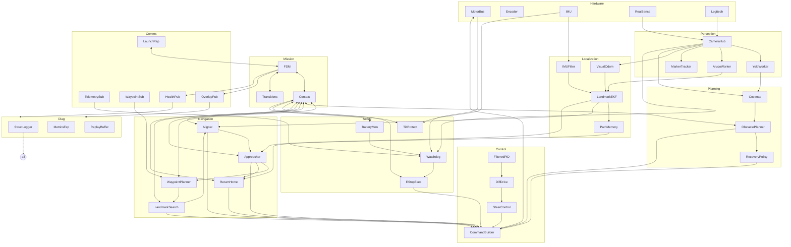
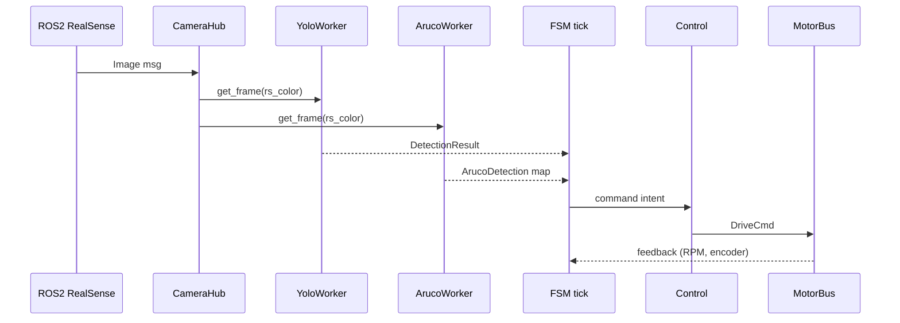
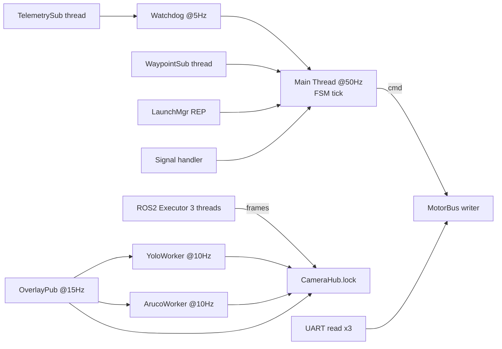
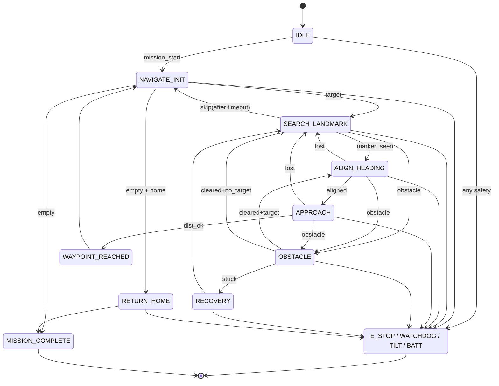
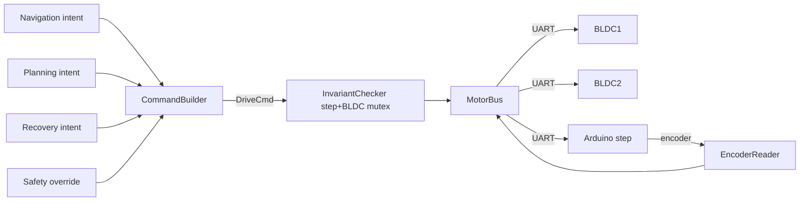
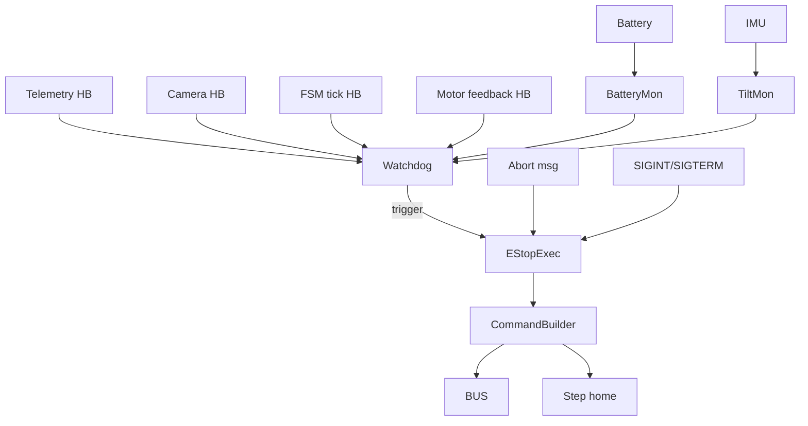
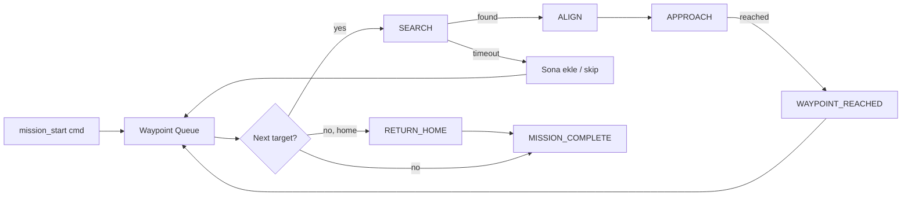

# `autonomous_driver.py` — Yeniden Yazım Planı, Mimari ve Roadmap

> Bu rapor, `autonomous_driver_analysis.md` ve `autonomous_driver_risks_and_gaps.md` dokümanlarının üstüne kuruludur. **14-19. bölümleri** kapsar: yeni mimari, requirement, roadmap, test planı, diyagramlar ve final değerlendirme.

---

## 14. Yeni Otonom Sürüş Kodu için Mimari Önerisi

### 14.1. Hedef Klasör/Modül Yapısı

```
autonomous_driver/                      # repo kök
├── pyproject.toml                      # paket meta + dev deps
├── config/
│   ├── erc2026.yaml                    # ArUco IDs, görev paramları
│   ├── hardware.yaml                   # portlar, baud, kamera matris
│   ├── perception.yaml                 # YOLO eşik, model yolları
│   ├── navigation.yaml                 # PID, search/approach paramları
│   └── safety.yaml                     # watchdog, timeout, eşikler
│
├── autonomous_driver/                  # python paket
│   ├── __init__.py
│   ├── runtime/
│   │   ├── launcher.py                 # composition root (eski main())
│   │   ├── lifecycle.py                # graceful start/stop
│   │   └── signal_handlers.py
│   │
│   ├── hardware/
│   │   ├── motor_bus.py                # ABC + DriveCmd
│   │   ├── uart_bus.py                 # UARTMotorBus
│   │   ├── can_bus.py                  # CANMotorBus (python-can)
│   │   ├── fake_bus.py                 # test/sim
│   │   ├── encoder.py                  # step encoder okuyucu
│   │   └── protocols.py                # struct format'ları, regex
│   │
│   ├── perception/
│   │   ├── camera_hub.py               # ROS2 abone + dict[str, Frame]
│   │   ├── yolo_worker.py              # det + seg
│   │   ├── aruco_worker.py             # detection + solvePnP
│   │   ├── tracker.py                  # KCF/CSRT marker tracking
│   │   └── frame.py                    # Frame dataclass (img + ts + meta)
│   │
│   ├── localization/
│   │   ├── imu_filter.py               # complementary / madgwick
│   │   ├── visual_odom.py              # OpenCV stereo/feature
│   │   ├── ekf.py                      # ArUco landmark + IMU + odom
│   │   ├── pose.py                     # Pose dataclass (x, y, yaw)
│   │   └── path_memory.py              # for return-home
│   │
│   ├── navigation/
│   │   ├── waypoint_planner.py         # TSP-lite + retry/skip
│   │   ├── landmark_search.py          # tek-yön rotate + translate
│   │   ├── alignment.py                # PID heading
│   │   ├── approach.py                 # PID + ileri
│   │   ├── return_home.py              # path-replay
│   │   └── reservations.py             # mission state
│   │
│   ├── planning/
│   │   ├── obstacle_planner.py         # costmap + DWA-lite
│   │   ├── costmap.py                  # occupancy grid
│   │   ├── recovery.py                 # stuck/escape behaviors
│   │   └── policies.py                 # priority hiyerarşisi
│   │
│   ├── control/
│   │   ├── pid.py                      # filtered PID
│   │   ├── differential_drive.py       # diff-drive kinematics
│   │   ├── steer_control.py            # 4 step motor steering
│   │   └── command_builder.py          # DriveCmd factory
│   │
│   ├── safety/
│   │   ├── watchdog.py                 # multi-source heartbeat
│   │   ├── e_stop.py                   # closed-loop home dönüş
│   │   ├── tilt_protection.py          # IMU tabanlı
│   │   ├── battery_monitor.py
│   │   └── invariants.py               # step+BLDC mutex check
│   │
│   ├── communication/
│   │   ├── telemetry_sub.py            # Sensors.py
│   │   ├── waypoint_sub.py             # GS waypoint
│   │   ├── overlay_pub.py              # annotated frames
│   │   ├── health_pub.py               # 1 Hz health
│   │   ├── launch_rep.py               # arc_electron uyumu
│   │   └── schemas.py                  # pydantic model'leri
│   │
│   ├── diagnostics/
│   │   ├── logger.py                   # JSON + rotating file
│   │   ├── metrics.py                  # Prometheus exporter
│   │   ├── replay.py                   # rosbag-style snapshot
│   │   └── overlay_renderer.py
│   │
│   ├── mission/
│   │   ├── fsm.py                      # state machine framework
│   │   ├── states/                     # her state ayrı dosya
│   │   │   ├── idle.py
│   │   │   ├── navigate_init.py
│   │   │   ├── search_landmark.py
│   │   │   ├── align_heading.py
│   │   │   ├── approach_waypoint.py
│   │   │   ├── waypoint_reached.py
│   │   │   ├── return_home.py
│   │   │   ├── obstacle_avoidance.py
│   │   │   ├── mission_complete.py
│   │   │   ├── e_stop.py
│   │   │   └── watchdog_triggered.py
│   │   ├── transitions.py              # transition table
│   │   └── context.py                  # FSM context dataclass
│   │
│   └── shared/
│       ├── types.py                    # DriveCmd, Action, State enum
│       ├── time_source.py              # monotonic-only utility
│       └── exceptions.py
│
└── tests/
    ├── unit/
    ├── integration/
    ├── hil/                            # hardware-in-the-loop
    ├── sim/                            # full sim
    └── fakes/                          # mock'lar
```

### 14.2. Modül Sözleşmeleri

#### `hardware/`
- **Sorumluluk**: BLDC + step motor + encoder ile UART/CAN üzerinden konuşmak.
- **Input**: `DriveCmd`. **Output**: yok (komut send).
- **Önerilen class'lar**: `MotorBus(ABC)`, `UARTMotorBus`, `CANMotorBus`, `FakeMotorBus`, `EncoderReader`.
- **Eski koddan taşınacak**: `MotorBus` ABC, `UARTMotorBus`, BLDC struct format, "MOTOR:..." string formatı.
- **Test stratejisi**: `FakeMotorBus` ile pozisyon simülasyonu; UART'a mock-serial.

#### `perception/`
- **Sorumluluk**: Kamera + YOLO + ArUco; veri akışını tek-noktadan sağla.
- **Input**: ROS2 topic'ler. **Output**: `Frame`, `Detection`, `Segmentation`, `ArucoDetection`.
- **Class'lar**: `CameraHub`, `YoloWorker`, `ArucoWorker`, `MarkerTracker`.
- **Eski koddan**: `ArucoWorker` _process iç mantığı; `CameraHub` topic abone deseni.
- **Test**: Pre-recorded image directory ile fake camera; YOLO yerine sabit bbox.

#### `localization/`
- **Sorumluluk**: rover pozisyonunu tahmin et (x, y, yaw).
- **Input**: IMU, visual odom, ArUco landmark detection. **Output**: `Pose`.
- **Class'lar**: `IMUFilter` (Madgwick/complementary), `VisualOdometry` (ORB-SLAM3 entegrasyonu opsiyonel; basitçe optical flow integral), `LandmarkEKF`, `PathMemory`.
- **Eski koddan**: yok (yeni modül).
- **Test**: synthetic trajectory injection; karşılaştırma plot.

#### `navigation/`
- **Sorumluluk**: ArUco hedefine git, eve dön.
- **Input**: `Pose`, `ArucoDetection`. **Output**: `DriveCmd` (control üzerinden).
- **Class'lar**: `WaypointPlanner`, `LandmarkSearch`, `HeadingAligner`, `Approacher`, `ReturnHome`.
- **Eski koddan**: `_s_align_heading`, `_s_approach_waypoint` PID çıktı hesabı.
- **Test**: birim testte fake aruco + hedef konumu varyasyonu.

#### `planning/`
- **Sorumluluk**: Engellerden kaçın, lokal yol bul.
- **Input**: `Detection`, `Segmentation`, depth, `Pose`. **Output**: `Action` veya direct `DriveCmd`.
- **Class'lar**: `Costmap`, `ObstaclePlanner` (DWA-lite), `RecoveryPolicy`.
- **Eski koddan**: `AvoidancePlanner.decide` mantığı bbox-only fallback olarak.

#### `control/`
- **Sorumluluk**: Yüksek seviye komutu motor seviyesine çevir.
- **Class'lar**: `FilteredPID`, `DifferentialDrive`, `SteerController`, `CommandBuilder`.
- **Eski koddan**: `PIDController`'ın iyileştirilmiş versiyonu.

#### `safety/`
- **Sorumluluk**: Watchdog, E-stop, tilt protection, batarya, mutex.
- **Class'lar**: `Watchdog`, `EStopExecutor`, `TiltMonitor`, `BatteryMonitor`, `MotorInvariantChecker`.
- **Eski koddan**: `Watchdog`, `execute_estop`.

#### `communication/`
- **Sorumluluk**: ZMQ kanalları + JSON şemaları.
- **Class'lar**: `TelemetrySubscriber`, `WaypointSubscriber`, `OverlayPublisher`, `HealthPublisher`, `LaunchResponder`.
- **Schemas**: pydantic ile her mesaj tipi (mission_start, abort, telemetry, health).

#### `diagnostics/`
- **Sorumluluk**: Loglama, metrik, replay buffer.
- **Class'lar**: structured logger setup, `MetricsExporter`, `EventBus`, `OverlayRenderer`.

#### `mission/`
- **Sorumluluk**: FSM çekirdeği.
- **Class'lar**: `FSM`, `State`, `Transition`, `Context` (immutable, per-tick yenilenir).
- **Eski koddan**: state ID'leri ve transition mantığı.

#### `runtime/`
- **Sorumluluk**: Bootstrap, dependency wiring, sinyal yönetimi, shutdown.
- **Class'lar**: `Launcher`, `LifecycleManager`.
- **Eski koddan**: `main()` adım sırası referans alınır.

#### `tests/`
- Unit (saf python), integration (gerçek ROS2 olmadan), HIL (gerçek motor + sahte kamera), sim (Gazebo veya benzer).

---

## 15. Yeni Kod için Requirement Dokümanı

> Tüm req'ler `MUST/SHOULD/MAY` ile etiketlenmiştir.

### 15.1. Functional Requirements (FR)

| ID | Req | Önemli notlar |
|----|-----|---------------|
| FR-1 | Sistem ZMQ üzerinden waypoint listesi MUST kabul etsin | JSON şema sabit |
| FR-2 | Hedef ArUco ID'sini MUST bulup ≤ approach_dist'e MUST yaklaşsın | ERC §7.3.2.1 |
| FR-3 | Bulamadığı hedefi listenin sonuna MUST ekleyip diğerleriyle MUST devam etsin | Bug-4 fix |
| FR-4 | Tüm waypoint'ler tamamlandıktan sonra return_home talep edilirse MUST eve dönsün | Path memory |
| FR-5 | Engel görünce SHOULD yavaşla → dur → kaçın → tekrar yöne dön | Smart avoidance |
| FR-6 | ALIGN_HEADING sırasında engel kontrolü MUST yapılsın | Bug-8 fix |
| FR-7 | Manuel mod (no-yolo + fake-obstacle) MUST mevcut olsun | Geliştirme |
| FR-8 | Annotated kamera 6000/6002/6003 ZMQ portuna MUST yayınlasın | GS uyumu |
| FR-9 | 1 Hz health JSON 6004'e MUST yayınlasın | GS uyumu |

### 15.2. Safety Requirements (SR)

| ID | Req |
|----|-----|
| SR-1 | Step + BLDC ASLA aynı tick'te tahrik almamalı; type-system veya runtime invariant ile MUST garanti edilsin |
| SR-2 | Telemetri/kamera kopukluğu MUST ≤ 2 s'te E-stop tetiklesin |
| SR-3 | Abort komutu MUST ≤ 100 ms'de E-stop tetiklesin |
| SR-4 | E-stop sırasında BLDC 0 hız + step home MUST yapılsın; encoder yoksa fail-safe brake (donanımdan) MUST aktif olsun |
| SR-5 | Tilt > 30° MUST tilt protection state'ine atsın |
| SR-6 | Batarya < %20 MUST graceful return_home tetiklesin; < %10 MUST E-stop tetiklesin |
| SR-7 | UART/serial port açılmazsa MUST fatal abort, IDLE'de bekle |
| SR-8 | Sensör fusion outlier (örn. tek-frame ArUco flip) MUST 2-frame consistency check |
| SR-9 | FSM tick freshness MUST 200 ms'den geç olmamalı; 500 ms'den geç ise MUST E-stop |

### 15.3. Performance Requirements (PR)

| ID | Req | Hedef |
|----|-----|-------|
| PR-1 | FSM tick latency | ≤ 10 ms ortalama, ≤ 30 ms p99 |
| PR-2 | YOLO inference | ≥ 10 Hz GPU, ≥ 3 Hz CPU |
| PR-3 | ArUco detection | ≥ 15 Hz |
| PR-4 | Overlay yayın | ≥ 10 Hz |
| PR-5 | E-stop reaksiyon | ≤ 200 ms |
| PR-6 | Memory budget | ≤ 1.5 GB sürekli |

### 15.4. Sensor Requirements

| ID | Req |
|----|-----|
| SnR-1 | RealSense D435i 848×480 RGB + depth |
| SnR-2 | Logitech RGB (kabin/üst) |
| SnR-3 | IMU (BNO055/MPU9250) → ROS2 topic |
| SnR-4 | Step encoder per motor (4 ad.) |
| SnR-5 | BLDC feedback (RPM, batV, temp) struct |
| SnR-6 | Optional: GNSS (kullanılmıyor ama dropt-in entegre olabilsin) |

### 15.5. Motor Control Requirements

| ID | Req |
|----|-----|
| MR-1 | BLDC: struct `<HhhH` 0xABCD start, [-1000, +1000] hız |
| MR-2 | Step: 4 bağımsız "MOTOR:d0,d1,d2,d3\n" L/R/S |
| MR-3 | Encoder yanıtı "POS:n0,n1,n2,n3\n" — 50 Hz veya event-driven |
| MR-4 | Step + BLDC mutex: type-safe `DriveCmd` builder ile |
| MR-5 | Komut spam koruması: aynı komut state girişinde bir kez |
| MR-6 | Reopen policy: port düşerse exponential backoff |

### 15.6. Mission Requirements

| ID | Req |
|----|-----|
| MsR-1 | 4 waypoint herhangi sırayla; 20 dk pencere |
| MsR-2 | Skip & retry: bulunamayan hedefi sona ekle |
| MsR-3 | approach_dist konfigüre edilebilir (varsayılan 1.5 m) |
| MsR-4 | return_home opsiyonel (mission JSON ile) |
| MsR-5 | Mission state restart sonrası persisted (opsiyonel) |

### 15.7. Testing Requirements

| ID | Req |
|----|-----|
| TR-1 | Birim test coverage ≥ %70 (hardware/perception/control hariç logic) |
| TR-2 | Tüm safety state geçişleri için integration test |
| TR-3 | HIL: gerçek motor + fake camera ile 1 saatlik mission soak test |
| TR-4 | Sim: full Gazebo veya kustom 2D simülasyon |
| TR-5 | Replay: production rosbag → unit reproduction |

### 15.8. Logging / Diagnostics Requirements

| ID | Req |
|----|-----|
| LR-1 | Structured JSON log (timestamp, level, module, event, ctx) |
| LR-2 | Rotating file (boyut limiti 100 MB, 5 yedek) |
| LR-3 | Console + file aynı anda |
| LR-4 | Health JSON (mevcut) + Prometheus exporter (opsiyonel) |
| LR-5 | Replay buffer: son 60 s sensör + komut snapshot, on-demand dump |
| LR-6 | FSM transition'ları audit log'da timestamp ile saklanmalı |

### 15.9. Configuration Requirements

| ID | Req |
|----|-----|
| CR-1 | YAML config dosyaları MUST validation (pydantic) ile yüklensin |
| CR-2 | CLI argümanları config'i override edebilsin |
| CR-3 | Profile sistemi: `dev`, `sim`, `bench`, `competition` |
| CR-4 | Hardware kalibrasyonu (kamera matrix) ayrı YAML dosyasında |
| CR-5 | Config file path env var ile değiştirilebilsin (`AD_CONFIG_DIR`) |

---

## 16. Uygulama Yol Haritası (Phase-by-Phase)

> Her phase için: amaç, dosyalar, testler, başarı kriterleri.

### Phase 0 — Hazırlık (1-2 gün)
- **Amaç**: Repo yapısı, tooling, CI iskeleti.
- **Yapılacak**: pyproject.toml, ruff/black, mypy, pytest config, GitHub Actions.
- **Başarı**: `make lint test` boş projede yeşil.

### Phase 1 — Konfigürasyon Altyapısı (2-3 gün)
- **Amaç**: YAML config + pydantic model.
- **Dosyalar**: `config/*.yaml`, `runtime/config.py`.
- **Test**: invalid YAML → friendly error.
- **Başarı**: `Settings.load()` tüm parametreleri tek nokta üzerinden döndürür.

### Phase 2 — Mock Motor Bus + DriveCmd Sözleşmesi (3-4 gün)
- **Amaç**: Type-safe komut akışı; `FakeMotorBus`.
- **Dosyalar**: `hardware/motor_bus.py`, `hardware/fake_bus.py`, `shared/types.py`.
- **Test**: Step+BLDC mutex invariant; mock encoder ile home dönüş.
- **Başarı**: 100% birim test; `python -m autonomous_driver.runtime.launcher --bus=fake` çalışıyor (henüz no-op).

### Phase 3 — Camera/Perception Interface (4-5 gün)
- **Amaç**: ROS2 yerine pluggable camera kaynağı; YOLO + ArUco modülleri.
- **Dosyalar**: `perception/*`.
- **Test**: Pre-recorded image dir → ArucoWorker tutarlı tespit; YoloWorker fake bbox.
- **Başarı**: Replay dataset üzerinde 30 saniye sürekli output.

### Phase 4 — FSM Çatısı (5-7 gün)
- **Amaç**: State pattern + transition table + context.
- **Dosyalar**: `mission/fsm.py`, `mission/states/*.py`, `mission/transitions.py`, `mission/context.py`.
- **Test**: Her state için entry/exit hook çağrılıyor; transition determinizmi.
- **Başarı**: 15 state'lik FSM mock context ile yarış senaryosunu tamamlıyor.

### Phase 5 — ArUco Navigation Stabilizasyonu (4-6 gün)
- **Amaç**: Bug-2 düzelt (search algoritması), bug-4 düzelt (skip&retry), filtered PID.
- **Dosyalar**: `navigation/landmark_search.py`, `navigation/alignment.py`, `navigation/approach.py`, `control/pid.py`.
- **Test**: Synthetic ArUco trajectory → rover tüm hedeflere ulaşıyor.
- **Başarı**: Sim ortamda 4 waypoint'in 4'ü tamamlanıyor, herhangi sırayla.

### Phase 6 — Obstacle Avoidance İyileştirmesi (5-7 gün)
- **Amaç**: Costmap + DWA-lite + recovery.
- **Dosyalar**: `planning/*`.
- **Test**: Fake-obstacle senaryoları; "stuck" recovery testi.
- **Başarı**: Çoklu engel arasından geçer, "stuck" durumda reverse + reroute.

### Phase 7 — Safety / Watchdog / E-Stop Layer (3-4 gün)
- **Amaç**: Multi-source watchdog, tilt protection, battery monitor, invariants.
- **Dosyalar**: `safety/*`.
- **Test**: Her sensör kopması → E-stop ≤ 2 s.
- **Başarı**: SR-1..SR-9 tümü test ile validasyon.

### Phase 8 — Localization (Visual Odom + IMU) (10-15 gün)
- **Amaç**: Pose tahmini; return_home gerçek implementation.
- **Dosyalar**: `localization/*`.
- **Test**: Synthetic IMU + camera → ≤ 5% drift / 100 m.
- **Başarı**: Fixed waypoint'lerden ev'e dönüş ≤ 10% pozisyon hatası.

### Phase 9 — Communication & Diagnostics (3-4 gün)
- **Amaç**: ZMQ ports + structured logging + replay buffer.
- **Dosyalar**: `communication/*`, `diagnostics/*`.
- **Test**: GS arc_electron uyumluluğu (ping/status/start/stop).
- **Başarı**: Replay JSON dump → unit test reproduction çalışıyor.

### Phase 10 — Simulation / Test Harness (5-7 gün)
- **Amaç**: Full sim test pipeline.
- **Dosyalar**: `tests/sim/*`, opsiyonel Gazebo entegrasyonu.
- **Test**: 4-waypoint full mission CI'da geçiyor.
- **Başarı**: Her PR'da sim test yeşil.

### Phase 11 — Real Rover Integration (5-7 gün)
- **Amaç**: Gerçek donanımda ilk full mission.
- **Test**: Bench (motorlar paletli) + saha (gerçek arazi).
- **Başarı**: Outdoor mission ≥ 1 hedef tamamlama.

### Phase 12 — Competition Readiness (sürekli)
- **Amaç**: ERC checklist + son ayar.
- **Checklist**:
  - [ ] 4 waypoint herhangi sırayla saha testi
  - [ ] 20 dk pencere stres testi
  - [ ] Telemetri kopukluğu testi
  - [ ] Abort komutu testi
  - [ ] E-stop fiziksel testi
  - [ ] Tilt protection test (rampa)
  - [ ] Düşük batarya senaryosu
  - [ ] Çoklu obstacle field
  - [ ] Hot ambient (40°C) thermal test
  - [ ] Yağmur/toz IP koruma testi
  - [ ] arc_electron tam ekran testi
  - [ ] Yedek SD/USB stick + recovery
  - [ ] Pre-mission checklist script

---

## 17. Test Planı

### 17.1. Unit Tests (saf Python, ROS2/UART yok)

| Test | Senaryo | Beklenen | Otomasyon |
|------|---------|----------|-----------|
| PID-001 | error=1.0 sabit | output → +limit (windup yok) | pytest |
| PID-002 | error reset → ölçüm | output finite | pytest |
| AVOID-001 | det boş | DRIVE | pytest |
| AVOID-002 | front-band'da büyük bbox | TURN_*  | pytest |
| AVOID-003 | seg masks ile drivable left>right | TURN_LEFT | pytest |
| AVOID-004 | depth NaN | DRIVE veya safe-fall | pytest |
| ARUCO-001 | obj_pts + img_pts know-good | distance ≈ ground truth | pytest (cv2 only) |
| ARUCO-002 | flip ambiguity case | tracker tutarlılığı | pytest |
| FSM-001 | IDLE + mission → NAVIGATE_INIT | transition | pytest |
| FSM-002 | terminal → execute_estop | done=True | pytest |
| WD-001 | telem son güncelleme > timeout | trigger_watchdog | pytest |
| WD-002 | kamera hiç gelmiyor + start_ts'den uzun | trigger_watchdog | pytest |
| MOTOR-INV-001 | step+bldc aynı anda → assert error | runtime invariant | pytest |
| CONFIG-001 | invalid YAML | pydantic ValidationError | pytest |

### 17.2. Integration Tests (mock'lu, full pipeline)

| Test | Senaryo | Beklenen | Otomasyon |
|------|---------|----------|-----------|
| INT-001 | FakeBus + FakeCamera + sahte ArUco | 1 hedef, full path | pytest + asyncio |
| INT-002 | Mid-mission abort | E_STOP ≤ 200 ms | pytest |
| INT-003 | Watchdog camera-loss | E-stop sequencing | pytest |
| INT-004 | Mission timeout | MISSION_COMPLETE @20dk | pytest (mock time) |
| INT-005 | Marker temporary loss → recover | SEARCH→ALIGN sürekli | pytest |
| INT-006 | Skip & retry | Bulamayanı sona ekle | pytest |
| INT-007 | Engelli yol + ArUco beraber | Avoidance sonra geri kazanım | pytest |

### 17.3. Hardware-in-the-Loop (HIL)

| Test | Setup | Beklenen | Otomasyon |
|------|-------|----------|-----------|
| HIL-001 | Gerçek motor (palet üstü) + fake kamera | Step+BLDC mutex; encoder → home dönüş | manual + log audit |
| HIL-002 | Gerçek RealSense + arazide statik ArUco | Detection rate ≥ 15 Hz | log inspect |
| HIL-003 | Battery sim drop → SR-6 | return_home tetikleme | manual |

### 17.4. Fake Obstacle Tests

| Test | Senaryo | Beklenen |
|------|---------|----------|
| FO-001 | `--fake-obstacle left` | rover SAĞA dönüyor |
| FO-002 | `--fake-obstacle right` | rover SOLA dönüyor |
| FO-003 | Obstacle clear sonrası | DRIVE devam |

### 17.5. Fake ArUco Tests

| Test | Senaryo | Beklenen |
|------|---------|----------|
| FA-001 | Sahte ID 51 dist=3 m heading=+0.3 rad | ALIGN sağa dönüş, sonra APPROACH |
| FA-002 | dist 1.4 m | WAYPOINT_REACHED |
| FA-003 | flip-prone açı | tracker iki frame consensus |

### 17.6. ZMQ Message Tests

| Test | Mesaj | Beklenen |
|------|-------|----------|
| ZMQ-001 | mission JSON valid | WaypointList |
| ZMQ-002 | abort | flag set |
| ZMQ-003 | malformed | warning, no crash |
| ZMQ-004 | health pub subscriber | her saniye paket |
| ZMQ-005 | overlay 6002 subscriber | JPEG decode başarılı |

### 17.7. Serial Mock Tests

| Test | Senaryo | Beklenen |
|------|---------|----------|
| SER-001 | mock-serial loopback | BLDC paket round-trip |
| SER-002 | port disconnect mid-stream | reopen attempt |
| SER-003 | corrupted feedback | parser drop, no crash |

### 17.8. Watchdog Tests

| Test | Senaryo | Beklenen |
|------|---------|----------|
| WD-T1 | telemetri 3 s yok | E-stop |
| WD-T2 | kamera 3 s yok | E-stop |
| WD-T3 | FSM tick > 500 ms | E-stop |
| WD-T4 | İlk paket öncesi (graceful start) | tetikleme yok |

### 17.9. E-Stop Tests

| Test | Senaryo | Beklenen |
|------|---------|----------|
| EST-001 | trigger_estop @ APPROACH | BLDC=0, step home, terminal |
| EST-002 | encoder yok | fallback STOP komutu |
| EST-003 | sigint | graceful E-stop |

### 17.10. Mission Timeout Tests

| Test | Senaryo | Beklenen |
|------|---------|----------|
| MT-001 | clock 20 dk + 1 s | MISSION_COMPLETE |
| MT-002 | hedef sırasında timeout | rover stop |

### 17.11. Camera Loss Tests

| Test | Senaryo | Beklenen |
|------|---------|----------|
| CL-001 | RealSense unsubscribe | watchdog 2 s |
| CL-002 | Logitech down | warning, mission devam (RealSense ana) |

---

## 18. Diyagramlar

### 18.1. High-Level Architecture (Yeni Tasarım)



### 18.2. Data Flow (Frame-Centric)


### 18.3. Thread / Process Diagram


### 18.4. FSM State Diagram (Yeni; daha temiz)


### 18.5. Motor Command Flow


### 18.6. Safety / Watchdog Flow


### 18.7. Mission Flow


---

## 19. Final Recommendation

### 19.1. Bu Kod Yarışmaya Ne Kadar Hazır?

**Hazırlık seviyesi: %35-45.** ERC §7.3.2.1'in *iskeletini* doğru çizmiş; donanım protokolleri (BLDC struct, step ASCII), ArUco solvePnP, FSM state listesi, ZMQ portları, watchdog katmanları yerinde. Ancak:

- `_s_search_landmark` algoritmik olarak **tarama yapmıyor** (BUG-2)
- `_s_return_home` lokalizasyonsuz **sahte** (BUG-3)
- Bulamadığı hedef sonrasında diğer hedefleri **atıyor** (BUG-4)
- IDLE'den otomatik sürmeye **başlıyor** (BUG-6)
- Ground station ile en kritik artefakt olan health JSON'unda fsm_state kullanılıyor ama bind sessiz (BUG-13)

**Karar**: Kod yarışmaya **doğrudan götürülmemeli**. Either (a) bug-1..bug-8 hızlı patch ile bir hafta içinde stabilize et, (b) yeni mimariyi modüler şekilde başlat ve eski kodu bench-test referansı olarak tut. (b) tercih edilirse, bu üç dokümana dayanarak ~6-8 hafta içinde competition-ready hale gelinebilir.

### 19.2. En Büyük 10 Risk

| # | Risk | Etki |
|---|------|------|
| 1 | `_s_search_landmark` yön salınımı → ArUco bulunmuyor | Mission fail |
| 2 | RETURN_HOME lokalizasyonsuz; sadece ileri sürer | Rover kaybolur, puan kaybı |
| 3 | İlk hedef bulunamayınca mission tamamen biter | Maksimum 3 hedef puan kaybı |
| 4 | IDLE'den otomatik DRIVE'a geçiş | Operatör kontrolü öncesi başıboş hareket |
| 5 | ALIGN_HEADING'de engel kontrolü yok | Çarpışma |
| 6 | Watchdog 10 s timeout (yorumla çelişiyor) | Geç tepki |
| 7 | step_pub ZMQ socket multi-thread paylaşım potansiyeli | Segfault |
| 8 | Encoder yokken E-stop fallback "S" — gerçek mekanik koruma yok | Donanım hasarı |
| 9 | Batarya/akım/tilt monitör yok | Termal/güç olayları farkedilmez |
| 10 | Test kapsamı sıfır | Regresyon görünmez |

### 19.3. En Acil 10 Düzeltme

| # | Düzeltme | Tahmin |
|---|----------|--------|
| 1 | `_s_search_landmark` tek yön + IMU yaw integral | 1-2 gün |
| 2 | `_s_return_home` ya kaldır ya path-replay | 3-5 gün |
| 3 | Bulamayan hedefi kuyruğun sonuna ekle | 0.5 gün |
| 4 | IDLE'den SCAN otomatik geçişi kaldır | 0.5 gün |
| 5 | ALIGN/APPROACH her ikisinde de planner çağır | 1 gün |
| 6 | `WATCHDOG_TIMEOUT_S` → 2 s; docstring tutarlılığı | 0.5 gün |
| 7 | `step_pub` socket'ini overlay'den çıkar veya thread-safe wrapper | 0.5 gün |
| 8 | Batarya/akım eşiği telemetriden çek + safety state | 1-2 gün |
| 9 | Per-state max-duration timeout | 1 gün |
| 10 | Smoke unit test seti (en az FSM transitions + planner) | 2-3 gün |

**Toplam acil müdahale**: ~10-15 gün.

### 19.4. Yeni Kodda İlk Başlanacak Yer

**Sıralama**:
1. `config/` ve `runtime/launcher.py` — composition root.
2. `shared/types.py` (DriveCmd, State, Pose, Frame).
3. `hardware/motor_bus.py` (ABC) + `hardware/fake_bus.py` (mock).
4. `mission/fsm.py` framework + `mission/states/*` iskelet.
5. `safety/watchdog.py` ve `safety/e_stop.py`.
6. Bu noktada **simülasyon**'da mission akış testleri çalıştırılabilir.
7. Sonra perception, localization, navigation katmanları.

### 19.5. Bu Koddan Korunması Gereken Fikirler

- **Step + BLDC mutex disiplini**: SETTLE_5MS ara durumu mutlaka korunmalı; type-system ile sertleştirilmeli.
- **Watchdog 2-katmanlı yapı**: Sensor + camera ayrı; genişletilebilir.
- **Annotated overlay yayın deseni**: GS ile sözleşme; `Rover3.py` ile mutex.
- **`MotorBus` abstraction**: UART/CAN/Fake için yeterli.
- **`Aruco_Worker` IPPE_SQUARE + dual-API switch**: solid.
- **`execute_estop` per-motor closed-loop home dönüşü** (C-2 fix).
- **ZMQ port haritası** (5560/5561/5562/6000-6004): GS ile kontrat.
- **`--fake-obstacle` development mode** kavramı genişletilebilir.

### 19.6. Bu Koddan Kaçınılması Gereken Tasarım Hataları

- **Tek dosyada 2k+ satır + 13 thread**: dağıt, izole et.
- **`getattr` reflection ile state dispatch**: explicit table tut.
- **Sessiz `except: pass`**: her hata tipini ya logla ya escalate et.
- **Hard-coded magic number'lar**: config'e taşı.
- **Kullanılmayan veri (`TelemetrySubscriber.state`, BLDC feedback, `DriveCmd` preset'leri)**: ya kullan ya sil.
- **State + flag karması**: `estop_flag/watchdog_flag/done` global; FSM context içine gömül.
- **Wall-clock + monotonic karışımı**: tek source.
- **Sahte feature ("RETURN_HOME" gerçek yok)**: ya yap ya işaretle.

### 19.7. Ekibin Cevaplaması Gereken Açık Sorular

1. **ERC 2026 ArUco ID'leri kesin 51-64 mü?** (Yorum vs kod çelişiyor.)
2. **CAN bus'a geçiş gerçekten planda mı, yoksa UART final mı?** (CANMotorBus stub'ı silelim mi?)
3. **Logitech kamera hangi rolde?** (overlay yayında var; FSM kullanmıyor.)
4. **IMU hangi ROS2 topic'inde gelecek?** (Şu an telemetri içinde JSON; native IMU msg mi?)
5. **GS arc_electron'un beklediği health JSON şeması tam mı?** (Sadece status/streams mi yetiyor?)
6. **`WAYPOINT_REACH_DIST_M = 1.5` ERC kuralıyla uyumlu mu?** (Resmi şartname doğrulanmalı.)
7. **Return home protokolü**: path replay mi, dead reckoning mı, GNSS izinli mi? (Bonus puan kaybı?)
8. **Arduino step motor firmware'i** rate-limit yapıyor mu? (50 Hz spam tehlikeli mi?)
9. **BLDC kart firmware'i feedback paketi gerçekten 0xABCD start frame ile mi gönderiyor?** (Spec doğrulama)
10. **Test platformu**: bench üzerinde palet mi, dış sahada mı çalışacak?
11. **YOLO modeli** (detect + seg) ne sınıf çıkarıyor? "drivable" / "rover" / "human" sınıf eşlemesi var mı?
12. **Step encoder gerçekten var mı?** (Yoksa E-stop fail-safe stratejisi farklı tasarlanmalı.)
13. **20 dk pencere içinde başarısız hedef için tekrar pas önerilen davranış mı?** (Bug-4 düzeltmesi davranışsal karar.)
14. **`StandaloneLaunchManager` rover_launcher.py altında subprocess mi yoksa standalone mu?** (`--no-launch-manager` flag'inin gerçek kullanımı netleştirilmeli.)
15. **Saha ışıklandırma & RealSense exposure**: pre-mission kalibrasyon adımı var mı?

---

## Ek-A. Hızlı Patch Önerileri (Eğer Yeniden Yazım Yerine Mevcut Kod Korunursa)

> Aşağıdaki patch'ler `autonomous_driver.py` dosyasında **yapılmadı** (kullanıcı talimatı gereği), ama yeni rover yazılımına başlamadan önce mevcut kodu yarışma sahası testine götürmek istenirse acil müdahale önerileridir.

| Patch | Satır | Değişiklik (özet) |
|-------|-------|--------------------|
| P-1 | 115 | `frozenset(range(51, 65))` |
| P-2 | 135 | `WATCHDOG_TIMEOUT_S = 2.0` |
| P-3 | 1607-1617 | `_scan_turn_dir` flip mantığı kaldır; sabit RIGHT (veya iki tam tur sonra translate) |
| P-4 | 1601-1604 | timeout sonrası `MISSION_COMPLETE` yerine `_waypoint_targets.append(_current_target)` + sıradakine |
| P-5 | 1513-1515 | IDLE → SCAN otomatik geçişi kaldır |
| P-6 | 1619-1648 | `_s_align_heading` başına planner kontrolü ekle |
| P-7 | 1716-1741 | `_s_return_home` `MISSION_COMPLETE`'e direkt geçir (sahte sürüş yerine) |
| P-8 | 1019-1020 | `set_step_pub` çağrısını kaldır; FSM'in step_pub'ı tek noktadan kullansın |
| P-9 | 416-422 | frame tamamlandıktan sonra `r['prev'] = None` |
| P-10 | 1538-1544 | TURN state başında bir kez step komut gönder, tekrar etme |

Bu patch'ler "minimum viable competition" için yeterli olabilir; ancak Bölüm 14'teki yeni mimari uzun vadeli sürdürülebilirlik için önerilir.

---

## Ek-B. Doğrudan Koddan Çıkarılan Sayısal/Yapısal Değerler (Hızlı Referans)

| Konu | Değer | Satır |
|------|-------|-------|
| Toplam dosya satırı | 2023 | — |
| Thread sayısı (bootstrap sonrası) | 12+ | main() |
| ZMQ port | 5560-5562, 6000-6004 | 154-166 |
| Serial port | /dev/ttyUSB0/1, /dev/ttyACM0 | argparse |
| Baud | 115200 | 285 |
| FSM state sayısı | 15 | 1363-1382 |
| FSM tick | 50 Hz | 169 |
| YOLO/ArUco | 10 Hz | 170-171 |
| Overlay/Health | 15 Hz / 1 Hz | 172-173 |
| Mission timeout | 1200 s (20 dk) | 136 |
| Search timeout | 120 s | 137 |
| Return home timeout | 240 s | 139 |
| Watchdog timeout | 10 s (yorum 2 s) | 135 |
| ArUco marker boyutu | 0.150 m | 116 |
| Camera matrix | fx=fy=617, cx=424, cy=240 (D435i 848×480) | 119-123 |
| PID | kp=80, ki=0, kd=20, lim=100 | 127-130 |
| Speed forward / turn | 100 / 80 | 110-111 |
| Approach distance | 1.5 m | 145 |
| Align threshold | 0.05 rad | 146 |
| Obstacle area threshold | 0.06 normalized | 149 |
| Front center band | 0.35 - 0.65 | 150 |
| YOLO conf threshold | 0.45 | 151 |
| ArUco lost ticks max | 25 | 142 |
| BLDC start frame | 0xABCD | 104 |
| Feedback frame size | 18 byte | 107 |

---

> **Bitti.** Toplam 3 doküman: `autonomous_driver_analysis.md`, `autonomous_driver_risks_and_gaps.md`, `autonomous_driver_rewrite_plan.md`.
> Bu set, yeni otonom sürüş kodu yazımına teknik temel oluşturur.
